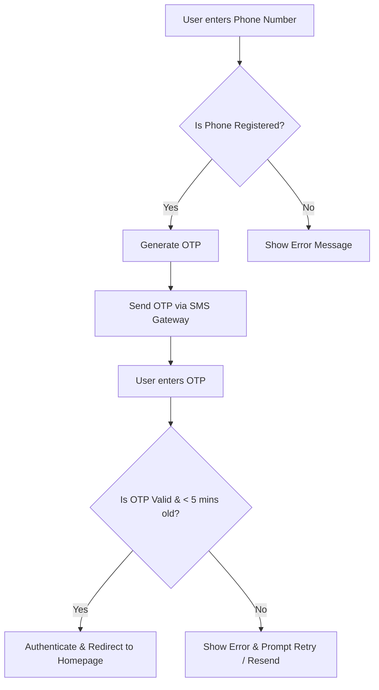
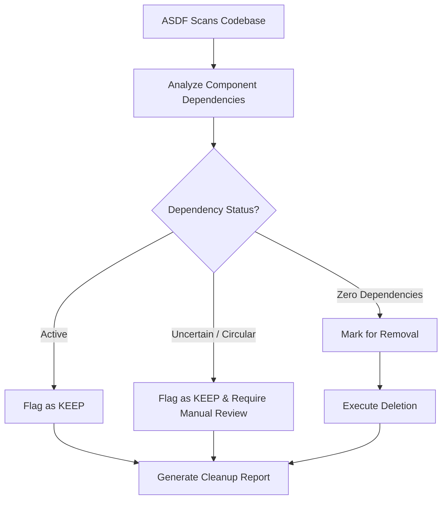

# Office Depot B2B Commerce Homepage Modernization & OTP Login

**ID:** OD-B2B-HP-001
**Version:** 1.0
**Status:** Draft
**Type:** Functional Specification

## Overview & Purpose
Office Depot is modernizing its Salesforce B2B Commerce storefront homepage to provide a highly intuitive, business-focused shopping experience heavily inspired by Amazon Business. The current environment contains legacy code, unused files, and obsolete customizations that complicate maintenance. The purpose of this project is twofold: first, to utilize the ASDF automated deployment framework to safely clean up the existing environment; second, to implement a new homepage featuring a robust header, promotional hero banner, grid-based category discovery cards, and dynamic product carousels displaying business pricing and bulk discounts. Additionally, the authentication flow will be updated to support a secure, frictionless phone number-based One-Time Password (OTP) login. The implementation mandates an "OOTB-first" approach, prioritizing Salesforce standard capabilities, CMS, and Flows over custom code.

## Goals
*   **OBJ-01:** Deliver a production-ready B2B Commerce homepage replicating the reference UX using native Salesforce capabilities wherever possible (>80% OOTB/Flow vs. custom LWC/Apex).
*   **OBJ-02:** Safely remove obsolete and unused files, components, and metadata from the existing Salesforce environment without causing regression errors.
*   **OBJ-03:** Implement a secure, frictionless login experience using phone number and OTP, maximizing the authentication success rate for users utilizing this method.

## Target Users
*   **Business Buyer:** End-users purchasing supplies on behalf of their organizations.
*   **Store Administrator:** Business users managing storefront content, banners, and layouts.
*   **ASDF / Deployment Agent:** The automated system/persona responsible for codebase cleanup and deployment sequencing.

## Stakeholders
*   **Business Buyer**
    *   *Decision authority:* None
    *   *Concerns:* Ease of finding products and categories; Visibility of bulk discounts and business pricing; Frictionless and secure login.
*   **Store Administrator**
    *   *Decision authority:* Approves CMS and layout configurations.
    *   *Concerns:* Ability to update banners and category cards without code; Proper enforcement of buyer group entitlements.
*   **ASDF / Deployment Agent**
    *   *Decision authority:* Executes codebase cleanup and deployment sequencing.
    *   *Concerns:* Clear dependency mapping for safe code deletion; Strict adherence to the implementation order (OOTB -> Flow -> LWC -> Apex).

## Scope

**In Scope:**
*   Automated codebase cleanup and dependency validation via the ASDF framework.
*   Implementation of a Phone Number/OTP-based authentication flow.
*   Global header with search, account, and cart access.
*   Salesforce CMS-driven promotional hero banner.
*   Grid-based category discovery cards filtered by Buyer Group entitlements.
*   Dynamic product carousels (e.g., Bestsellers, Deals) displaying business pricing and bulk discount tiers.

**Out of Scope:**
*   Authentication via third-party social logins (e.g., Google, Facebook).
*   Copying proprietary Amazon source code, trademarks, or copyrighted assets.
*   Hardcoding product IDs, category IDs, or buyer IDs into any component or configuration.
*   Implementing custom authentication mechanisms outside of the requested Phone/OTP flow and existing approved Salesforce identity configurations.

## MoSCoW
None specified.

## Functional Requirements

*   **FR-01: OTP Authentication Flow**
    *   The system shall provide a login flow that accepts a phone number, generates a One-Time Password (OTP), sends it via SMS, and validates the user's input to grant access.
    *   *Acceptance Criteria:*
        *   **Given** a user is on the login page, **When** they submit a registered phone number, **Then** the system generates and sends a 5-minute valid OTP via SMS.
        *   **Given** the user receives the OTP, **When** they submit the correct OTP within 5 minutes, **Then** they are authenticated and redirected to the homepage.
        *   **Given** the user submits an incorrect or expired OTP, **When** the system validates the input, **Then** access is denied and an error message is displayed prompting a retry.
*   **FR-02: ASDF Dependency Validation & Cleanup**
    *   The system (via ASDF) shall execute a dependency validation check on all existing LWC, Apex, Flow, and metadata components before executing any deletion.
    *   *Acceptance Criteria:*
        *   **Given** ASDF scans the codebase, **When** a component has zero active dependencies, **Then** it is marked for removal and logged in the cleanup report.
        *   **Given** ASDF scans the codebase, **When** a component has active, uncertain, or circular dependencies, **Then** it is flagged as 'KEEP' and blocked from deletion pending manual review.
*   **FR-03: Global Storefront Header**
    *   The system shall display a global header containing a search bar, category dropdown, account menu, and cart icon, utilizing standard B2B Commerce components.
    *   *Acceptance Criteria:*
        *   **Given** a user navigates to the storefront, **When** the page renders, **Then** the global header is visible and functional across all breakpoints.
*   **FR-04: CMS-Driven Hero Banner**
    *   The system shall display a responsive Hero Banner section driven by Salesforce CMS, allowing administrators to update images, headlines, and CTA links without code changes.
    *   *Acceptance Criteria:*
        *   **Given** an administrator publishes CMS content for the hero banner, **When** a user loads the homepage, **Then** the banner displays the configured image, text, and CTA.
        *   **Given** CMS content is missing or unpublished, **When** a user loads the homepage, **Then** the hero section collapses gracefully without breaking the layout or showing broken images.
*   **FR-05: Entitlement-Based Category Cards**
    *   The system shall render category discovery cards dynamically based on the active B2B Commerce catalog and the user's Buyer Group entitlements.
    *   *Acceptance Criteria:*
        *   **Given** a user belongs to Buyer Group A, **When** the category cards render, **Then** only categories authorized for Buyer Group A are displayed.
*   **FR-06: Dynamic Product Carousels with Bulk Pricing**
    *   The system shall render product carousels (e.g., Bestsellers, Deals) that dynamically pull product data, including negotiated business pricing and bulk discount tiers, from the Salesforce pricing engine.
    *   *Acceptance Criteria:*
        *   **Given** a product has configured bulk discount tiers, **When** it appears in a homepage carousel, **Then** the carousel card displays the business price, MRP, and the bulk discount messaging (e.g., "Save 17% on 2+ units").

## User Stories

*   **US-01** — As a Business Buyer, I want to log in using my phone number and an OTP, so that I can securely access my account without needing to remember a password.
    *   *Acceptance Criteria:*
        *   **GIVEN** I am on the storefront login page **WHEN** I enter my registered phone number and request an OTP **THEN** the system sends an OTP to my phone and prompts me to enter it.
        *   **GIVEN** I have received an OTP **WHEN** I enter the correct OTP within the validity period **THEN** I am successfully authenticated and redirected to the homepage.
*   **US-02** — As a System Administrator, I want to have the ASDF framework analyze and remove unused codebase artifacts, so that the Salesforce org remains clean, maintainable, and free of technical debt.
    *   *Acceptance Criteria:*
        *   **GIVEN** the ASDF framework scans the existing implementation **WHEN** it identifies files, classes, or components with zero active dependencies **THEN** it marks them for removal and logs the action in the cleanup report.
        *   **GIVEN** a component has uncertain or active dependencies **WHEN** the ASDF framework evaluates it **THEN** it flags the component as 'KEEP' and blocks deletion pending manual review.
*   **US-03** — As a Business Buyer, I want to view a comprehensive header and promotional hero banner, so that I can easily search for products, access my account, and see current business offers.
    *   *Acceptance Criteria:*
        *   **GIVEN** I load the homepage **WHEN** the page renders **THEN** I see a header with search, account, and cart links, and a CMS-driven hero banner.
*   **US-04** — As a Business Buyer, I want to browse products via visual category cards, so that I can quickly navigate to specific departments like Office Supplies or Electronics.
    *   *Acceptance Criteria:*
        *   **GIVEN** I am on the homepage **WHEN** I scroll to the category section **THEN** I see grid-based category cards that link to the respective Product Listing Pages (PLPs).
        *   **GIVEN** I belong to a specific Buyer Group **WHEN** the category cards render **THEN** I only see categories that my Buyer Group is entitled to view.
*   **US-05** — As a Business Buyer, I want to view dynamic product carousels for Bestsellers and Deals, so that I can discover popular products and view bulk discount pricing directly on the homepage.
    *   *Acceptance Criteria:*
        *   **GIVEN** I am viewing the homepage **WHEN** I scroll to the product carousels **THEN** I see products displaying their image, title, rating, business price, MRP, and bulk discount tiers.

## Inputs/Outputs/Data Flow

*   **Inputs:**
    *   User Phone Number (Login UI)
    *   OTP Code (Login UI)
    *   Salesforce CMS Content (Images, Copy, Links for Hero Banner)
    *   Buyer Group ID (Contextual session data)
    *   Salesforce Pricing Engine Data (Base price, negotiated price, bulk discount tiers)
*   **Outputs:**
    *   SMS Message containing OTP token.
    *   Authenticated User Session Token.
    *   Rendered Homepage UI (Header, Hero, Categories, Carousels).
    *   ASDF Cleanup Report (Logs of deleted items and items flagged for review).
*   **Data Flow:**
    *   *Auth Flow:* User Input -> Salesforce Identity / Login Flow -> SMS Gateway -> User Device -> User Input -> Validation -> Auth Session.
    *   *UI Flow:* User Session -> Buyer Group Entitlement Check -> Query Catalog & Pricing Engine -> Query CMS -> Render LWC/Standard Components.

## Flows

### OTP Login Flow

### ASDF Codebase Cleanup Flow

## Edge Cases & Error States
*   **EC-01 (Auth):** User enters an incorrect or expired OTP during login.
    *   *Handling:* The system denies access, displays a clear error message, and provides an option to request a new OTP.
*   **EC-02 (UI):** CMS content for a hero banner or category card is missing or unpublished.
    *   *Handling:* The system gracefully collapses the missing section without breaking the page layout or displaying broken image icons.
*   **EC-03 (ASDF):** The ASDF framework encounters a circular dependency or uncertain reference during cleanup analysis.
    *   *Handling:* The framework marks the affected components as 'KEEP', logs a warning in the cleanup report, and requires manual administrator review.

## Acceptance Criteria (Given/When/Then)
*(Note: Detailed Acceptance Criteria are mapped directly to their respective Functional Requirements and User Stories above to ensure strict traceability.)*

*   **Global Standard:**
    *   **Given** any feature implementation, **When** evaluated against Salesforce native capabilities, **Then** custom LWC/Apex is only utilized if OOTB configuration or Flows cannot satisfy the requirement.
    *   **Given** a user accesses the storefront on a mobile, tablet, or desktop device, **When** the UI renders, **Then** all components are 100% functional and visually intact.

## Non-Functional Requirements
*   **NFR-01 (Security):** OTP tokens must be securely generated, transmitted, and validated without being logged in plain text, and must expire after exactly 5 minutes.
*   **NFR-02 (Usability):** The homepage and all its components (header, hero, categories, carousels) must be fully responsive (100% functional and visually intact across standard desktop, tablet, and mobile breakpoints).
*   **NFR-03 (Maintainability):** The implementation must prioritize OOTB configuration and Flows over custom code. Target: 0 custom Apex classes or LWC components used for features natively supported by Salesforce B2B Commerce.

## Assumptions
*   **AD-01 (Dependency):** An SMS gateway or Salesforce Identity configuration is available and licensed to support the Phone/OTP login requirement. *(Impact if wrong: The requested OTP login flow cannot be implemented, blocking US-01).*
*   **AD-02 (Dependency):** The ASDF framework is fully operational and capable of accurately mapping Salesforce metadata dependencies. *(Impact if wrong: The codebase cleanup cannot be automated safely, requiring manual, error-prone analysis).*

## Dependencies
*   Salesforce B2B Commerce License and active Catalog/Pricing Engine.
*   Salesforce CMS configured and accessible for storefront content.
*   External SMS Gateway (or native Salesforce Identity SMS capabilities) for OTP delivery.
*   ASDF Framework deployment agent.

## Open Questions
*   **OQ-01:** The high-level definition explicitly requests a phone number/OTP login, but the attached Requirement.md states 'Do not implement a separate custom authentication mechanism unless explicitly required.' Does the OTP flow replace standard password login, or is it an alternative option? *(Recommended default: Implement the Phone/OTP flow as an alternative login option using standard Salesforce Identity features (e.g., Login Flows) rather than building a fully custom authentication mechanism from scratch).*
*   **OQ-02:** Images 3 and 4 show bulk discount messaging (e.g., 'Save 17% on 2+ units'). Does the current Office Depot Salesforce B2B Commerce pricing configuration natively support exposing these tier-based discounts on homepage product carousels? *(Recommended default: Assume standard B2B Commerce pricing tiers are configured, and utilize minimally customized LWC carousels to expose this data if OOTB carousels do not support tier-display natively).*
*   **OQ-03:** MoSCoW prioritization was not provided in the requirements document. How should the functional requirements be prioritized for the initial release?

## Success Metrics
*   **SM-01 (Lagging):** Homepage Page Load Time. Target: < 2.5 seconds on desktop. (Data required: Browser performance metrics and Salesforce Experience Cloud page load analytics).
*   **SM-02 (Leading):** Codebase Cleanup Rate. Target: 100% of confirmed obsolete files removed. (Data required: ASDF pre- and post-cleanup dependency reports).
*   **SM-03 (Adoption):** OOTB Utilization. Target: >80% of homepage features implemented using OOTB configuration or Flow vs. custom LWC/Apex.
*   **SM-04 (Adoption):** Authentication success rate for users utilizing the OTP login method.