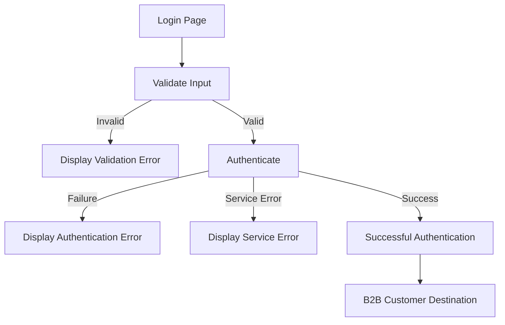
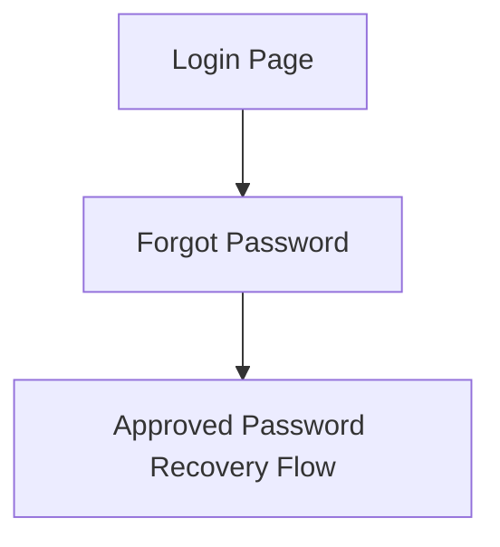

# Office Depot Negocios B2B Login

**ID:** ODN-B2B-LOGIN-001  
**Version:** 1.0  
**Status:** Draft  
**Type:** Functional Specification  

## Overview & Purpose
The purpose of this specification is to define a secure, responsive, accessible, and user-friendly login experience for registered Office Depot Negocios B2B customers. The feature will authenticate customers using their registered email address and password, providing appropriate handling for validation errors, unsuccessful authentication, and service failures.

## Goals
* Provide a secure authentication mechanism leveraging native Salesforce/platform capabilities.
* Ensure a responsive and accessible user interface across desktop, tablet, and mobile devices.
* Gracefully handle and communicate validation errors, authentication failures, and system errors without exposing sensitive technical or account-existence data.

## Target Users
* **Registered Office Depot Negocios B2B Customers:** Users who already have an active account and need to access their business account and available B2B benefits.

## Stakeholders
* None specified.

## Scope

### In Scope
* Login page UI and Office Depot Negocios branding.
* Email and Password input fields.
* Password visibility toggle.
* Login button/action.
* Password recovery link/action.
* Input validation (client-side).
* Authentication via Salesforce/platform.
* Authentication failure and service/system error handling.
* Successful-login navigation to the B2B destination.
* Responsive layout (Desktop, Tablet, Mobile).
* Accessibility (Keyboard navigation, screen reader support).
* Automated tests (Unit, Integration, UI).

### Out of Scope
* New customer registration.
* Customer profile management.
* Multi-Factor Authentication (MFA).
* Social login.
* Single Sign-On (SSO).
* Checkout, order management, and payment processing.

## Functional Requirements

### 1. Page Layout & Branding
* **FR-1.1:** The login page MUST display Office Depot Negocios branding/logo, a login heading, approved informational content, and a validation/error message area.
* **FR-1.2:** The visual design MUST follow the approved UI design.

### 2. Email Field
* **FR-2.1:** The email field MUST be a required text input.
* **FR-2.2:** The field MUST validate standard email format.
* **FR-2.3:** Leading and trailing whitespace SHOULD be handled appropriately.
* **FR-2.4:** The email value MUST NOT be written to logs unnecessarily.

### 3. Password Field & Visibility Control
* **FR-3.1:** The password field MUST be a required password input, masked by default.
* **FR-3.2:** A password visibility control MUST be available to toggle between masked and visible states.
* **FR-3.3:** Toggling visibility MUST NOT clear the entered password value.
* **FR-3.4:** The visibility control MUST have an accessible label/name, be keyboard accessible, and communicate its state to assistive technologies.
* **FR-3.5:** Passwords MUST NOT be logged, persisted outside the supported authentication flow, or exposed through telemetry.

### 4. Login Action
* **FR-4.1:** The login action MUST validate required fields and stop processing if validation fails.
* **FR-4.2:** The system MUST prevent duplicate submissions while authentication is processing and SHOULD display a loading/progress state.
* **FR-4.3:** The system MUST initiate the supported Salesforce/platform authentication flow.

### 5. Successful Authentication
* **FR-5.1:** Upon success, an authenticated Salesforce/platform session MUST be established.
* **FR-5.2:** The customer MUST be redirected to the intended B2B destination and granted access to permitted functionality.
* **FR-5.3:** Authentication/session information MUST NOT be displayed to the customer unnecessarily.

### 6. Password Recovery
* **FR-6.1:** The page MUST provide a clearly visible password recovery option.
* **FR-6.2:** Selecting the option MUST direct the user to the approved Salesforce-supported password recovery process.
* **FR-6.3:** The recovery flow MUST NOT expose unnecessary account-existence information.

## User Stories

**User Story 1: Core Login**
**As a** registered Office Depot Negocios customer
**I want** to log in to my B2B account using my email address and password
**So that** I can securely access my business account and available B2B benefits.
* *Acceptance Criteria:* AC-01, AC-06, AC-07, AC-08, AC-09

**User Story 2: Form Validation**
**As a** registered Office Depot Negocios customer
**I want** the login form to validate my inputs before submission
**So that** I can correct formatting or missing information immediately.
* *Acceptance Criteria:* AC-02, AC-03, AC-04

**User Story 3: Password Visibility**
**As a** registered Office Depot Negocios customer
**I want** to toggle the visibility of my typed password
**So that** I can verify I have entered it correctly before submitting.
* *Acceptance Criteria:* AC-05

**User Story 4: Password Recovery**
**As a** registered Office Depot Negocios customer who forgot their password
**I want** to access a password recovery flow from the login page
**So that** I can reset my credentials and regain access to my account.
* *Acceptance Criteria:* AC-10

## Inputs/Outputs/Data Flow

* **Inputs:** 
  * Customer Email Address
  * Customer Password
* **Outputs:** 
  * Salesforce Authenticated Session (Cookie/Token)
  * UI Validation Messages
  * UI Error Messages (Authentication Failure, System Error)

## Flows

### Login Flow

### Password Recovery Flow

## Edge Cases & Error States

| Scenario | Expected Behavior |
|---|---|
| **Email empty** | Display required-field validation (`Email is required.`). Authentication is not initiated. |
| **Email invalid** | Display email-format validation (`Enter a valid email address.`). Authentication is not initiated. |
| **Password empty** | Display required-field validation (`Password is required.`). Authentication is not initiated. |
| **Invalid credentials** | Authentication fails. Display safe authentication error (e.g., `Unable to sign in with the provided credentials. Please verify your information and try again.`). Do not reveal if the email exists. Allow retry. |
| **Authentication service unavailable** | Display user-friendly service error. Do not expose technical details or credentials. Allow retry. |
| **Unexpected exception** | Display generic error and log safely (excluding sensitive info). |
| **Duplicate submit** | Prevent duplicate request while authentication is in progress. |

## Acceptance Criteria

* **AC-01 — Login Page Display:** **Given** a registered Office Depot Negocios customer, **When** the customer opens the login page, **Then** the Office Depot Negocios login UI is displayed according to the approved design.
* **AC-02 — Required Email:** **Given** the login page is displayed, **When** the customer submits the form without an email, **Then** the system displays an email-required validation message **And** authentication is not initiated.
* **AC-03 — Email Format:** **Given** the login page is displayed, **When** the customer enters an invalid email format, **Then** the system displays an appropriate validation message **And** authentication is not initiated.
* **AC-04 — Required Password:** **Given** the login page is displayed, **When** the customer submits the form without a password, **Then** the system displays a password-required validation message **And** authentication is not initiated.
* **AC-05 — Password Visibility:** **Given** a password has been entered, **When** the customer selects the password visibility control, **Then** the password visibility changes **And** the entered password remains unchanged.
* **AC-06 — Successful Login:** **Given** the customer enters valid registered credentials, **When** the customer selects Login, **Then** authentication succeeds **And** an authenticated session is established **And** the customer is redirected to the intended B2B destination.
* **AC-07 — Invalid Credentials:** **Given** the customer enters invalid credentials, **When** the customer selects Login, **Then** authentication fails **And** the customer remains unauthenticated **And** a safe authentication error is displayed.
* **AC-08 — Service Error:** **Given** the authentication service is unavailable or returns an unexpected error, **When** the customer attempts to log in, **Then** a user-friendly service error is displayed **And** technical details are not exposed.
* **AC-09 — Duplicate Submission:** **Given** authentication is in progress, **When** the customer attempts to submit the login form again, **Then** duplicate authentication requests are prevented.
* **AC-10 — Password Recovery:** **Given** the customer is on the login page, **When** the customer selects password recovery, **Then** the customer is taken to the approved password recovery flow.
* **AC-11 — Responsive Layout:** **Given** the customer accesses the login page on desktop, tablet, or mobile, **When** the page is displayed, **Then** all required login functionality remains usable **And** no horizontal scrolling or layout overlap occurs.
* **AC-12 — Accessibility:** **Given** the customer uses keyboard navigation or assistive technology, **When** they interact with the login page, **Then** form fields, actions, errors, and password visibility controls are accessible and understandable.

## Non-Functional Requirements

### Security
* The implementation MUST use the supported Salesforce/platform authentication mechanism.
* The implementation MUST NOT store passwords, compare passwords in custom Apex, store passwords in Salesforce records or browser storage, put passwords in URLs, log passwords, log session IDs/auth tokens, or hard-code credentials/secrets.
* Custom Apex SHOULD NOT be used to authenticate email/password credentials. If Apex is required for non-auth functionality, it must enforce security, sharing rules, validate input, and avoid returning sensitive information.

### UI/UX (Responsive Design)
* **Desktop:** Maintain the approved desktop layout and branding.
* **Tablet:** Form and supporting content must remain readable and usable without horizontal scrolling.
* **Mobile:** Page must fit within the viewport, keep fields/actions usable and accessible, avoid overlapping elements, maintain readable text, and support common mobile keyboard behavior.

### Accessibility
* The page MUST support keyboard navigation, visible focus, semantic form controls, accessible field labels, accessible validation messages, accessible password visibility control, logical tab order, sufficient color contrast, and error communication that does not depend only on color.
* The implementation SHOULD follow the project's adopted WCAG accessibility target.

### Technical Architecture
* Preferred implementation is to leverage native Salesforce B2B Commerce / Experience Cloud authentication and site/login capabilities.
* Use Lightning Web Components (LWC) only for presentation and interaction customizations required by the approved design. Avoid custom LWC if standard components suffice.

## Assumptions
* None specified.

## Dependencies
* Salesforce B2B Commerce / Experience Cloud platform.
* Salesforce-supported password recovery functionality.

## Open Questions
* Who are the specific business and technical stakeholders for approval?
* What are the specific Success Metrics for this feature?
* What are the underlying assumptions for this project?
* What is the exact URL/path for the intended B2B destination post-login?
* What specific WCAG level (e.g., AA, AAA) is the adopted accessibility target for the project?

## Success Metrics
* None specified.